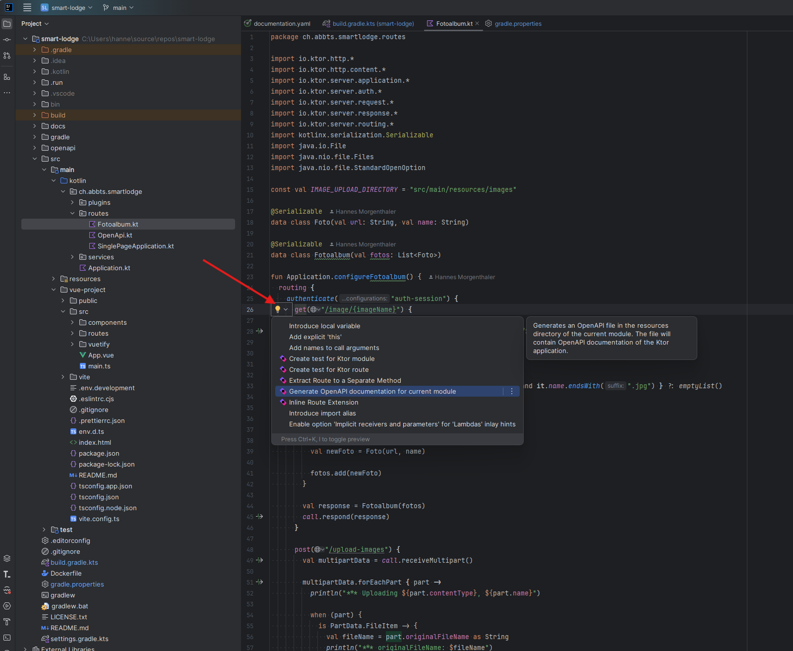
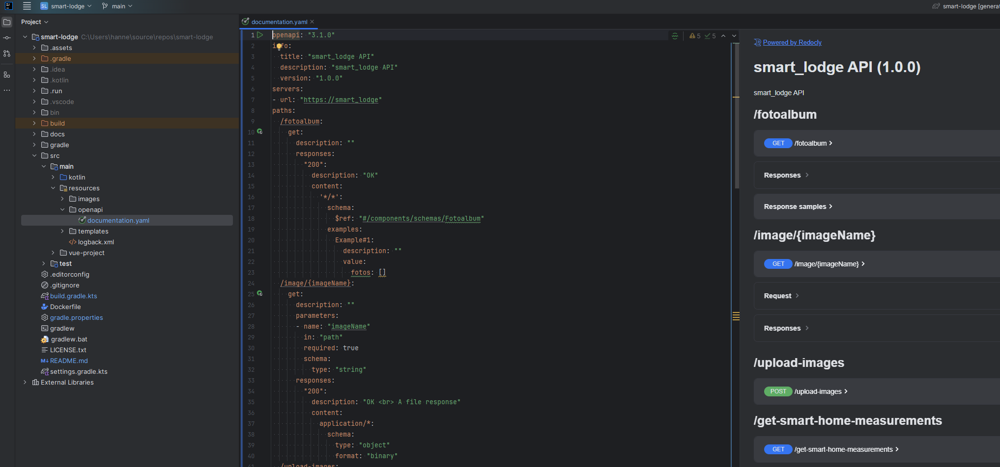

# Smart Lodge

## OpenAPI / Swagger

### Generate the OpenAPI spec:



## Usage with Docker

### Build

```shell
docker build -t smart-loge:dev-latest -f ./Dockerfile .
```

### RUN

```shell
docker run -p 8080:8080 smart-loge:dev-latest
```
